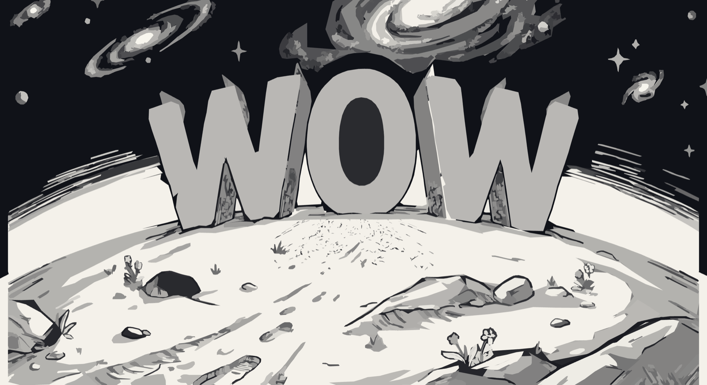

# Ordvärlden

[](https://www.patreon.com/AndersBjarby)

Skriv ett ord → en AI tecknar ett monument av ordet på en liten planet →
teckningen vektoriseras → WebGPU låter dig **rusa över planeten** mellan orden,
medan himlen morphar och nästa ord stiger upp över den krökta horisonten.
Eller ladda upp en hel låt och res genom dess text i takt med sången.



Tekniker: Gemini-bildgenerering (via OpenRouter) → vtracer-vektorisering →
whisper.cpp-transkribering med DTW-ordtider → egen WebGPU-renderer med
målarordningsdjup, kameradolly, GPU-vertexmorph och radiell fartoskärpa.

## Krav

- Python 3.12+ med venv (`pip install -r requirements.txt`)
- [vtracer](https://github.com/visioncortex/vtracer) CLI (`cargo install vtracer`)
- [whisper.cpp](https://github.com/ggerganov/whisper.cpp) byggd med `whisper-cli`
  + modellen `ggml-large-v3-turbo.bin` (sökvägar via env `WHISPER_CLI`/`WHISPER_MODEL`)
- ffmpeg
- `OPENROUTER_API_KEY` i miljön eller `.env` (bildgenereringen)
- Webbläsare med WebGPU (Chrome/Edge/Safari)

## Kör

```bash
# förutsätter venv/ (python3 -m venv venv && venv/bin/pip install openai pillow)
# och vtracer-CLI (cargo install vtracer), samt OPENROUTER_API_KEY i miljön/.env
venv/bin/python server.py        # http://localhost:8144
```

Två ord (`assets/words/`) följer med — nya skapas direkt i webbappen
(textfältet, ~30–60 s per ord: teckning + vektorisering).

## Kontroller

- **Autofärd** framåt; **scrolla** eller håll **W/S** för fart, **mellanslag** pausar
- **Dra** med musen för att titta omkring
- **Enter** fokuserar ordfältet — skriv och **Skapa**
- **♪** öppnar låt-läget (se nedan); i låt-läge pausar mellanslag låten

## Låt-läge

Ladda upp en låt (mp3/m4a/wav — **inte AIFF**, Chrome saknar avkodare) →
whisper-cli transkriberar ord-för-ord med tidsstämplar → varje unikt ord
genereras/vektoriseras (återkommande ord återanvänds gratis; UI:t visar antal
och kostnad innan generering) → **Spela**: kameran rusar genom orden i takt
med sången — du anländer till varje ord exakt när det sjungs. Täta textrader =
warpfart, instrumentala luckor (> 8 s) fylls med ordlösa mellanspelsscener
(`assets/interludes/`, genereras en gång och roteras). Karaoke-remsan visar
föregående/aktuellt/nästa ord (♪ för mellanspel). Barrel rolls inträffar då och
då — i låt-läge bara på väg in i mellanspel.

Effekter: radiell fartoskärpa mot kanterna (styrka ∝ fart) via en
efterbehandlingspass; kamerasway/bob och FOV-komposition per CONTRACT.

## Arkitektur

Se `CONTRACT.md` — den fryser alla gränssnitt (scene JSON, vertexformat,
uniforms, resemodellen). Kortversion:

- `tools/pipeline.py` — ord → PNG (stilreferens = förra ordet) → posterisering
  → vtracer (stacked polygon) → `scene.json` (former i målarordning)
- `server.py` — statiskt + API + genereringskö (port **8144**)
- `web/js/morph.js` — formmatchning A↔B, djup ur målarordning, GPU-vertexdata
- `web/js/renderer.js` — WebGPU: ett draw-call, 2 instanser (A-diorama,
  B-diorama), kameraförankrat morphande fjärrfält, duck-under/rise-over
- `web/js/planet.js` — kameramatematik + `Journey` (fart med tröghet, loop)
- `web/js/main.js` — integration; `window.ORD` är debughandtaget

## Nyckelinsikt

vtracer stacked-läge är back-to-front-kompositering: **den enda vilokorrekta
djupordningen är målarordningen själv.** Semantiska band ur bbox går sönder
(himlens bbox når ner till horisontdippen). Djup = kontinuerlig funktion av
målarindex; massiva former (> 8 % av bilden) + galaxer morphar som miljö,
detaljer (bokstäver ≈ 5 %) världsförankras och flyger förbi.
